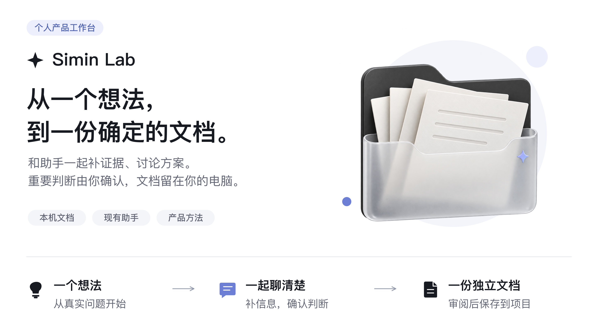
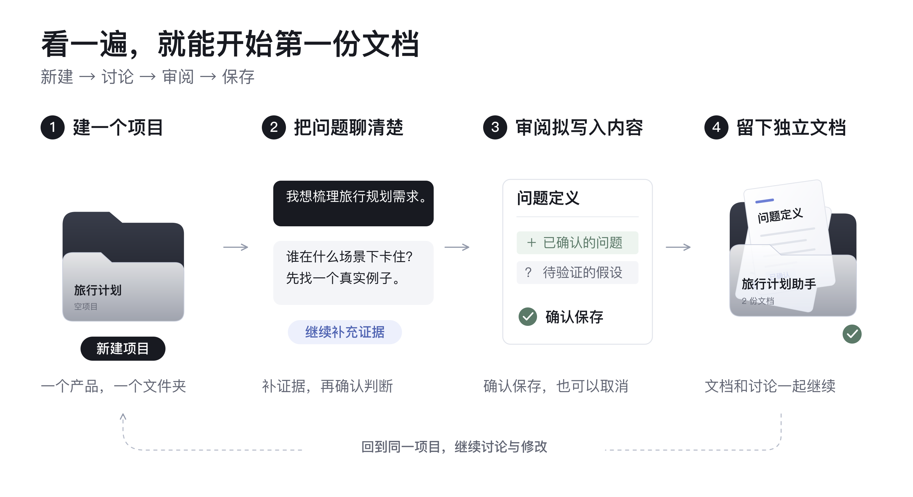
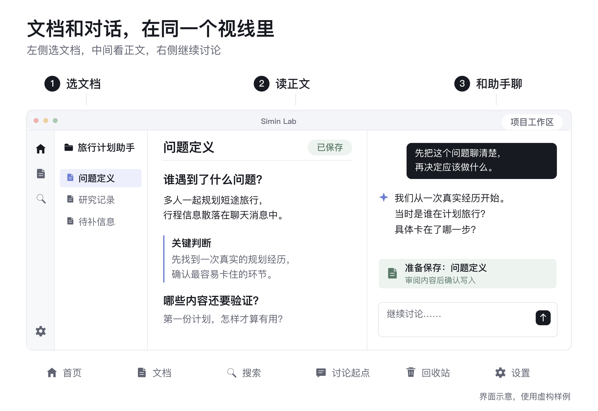
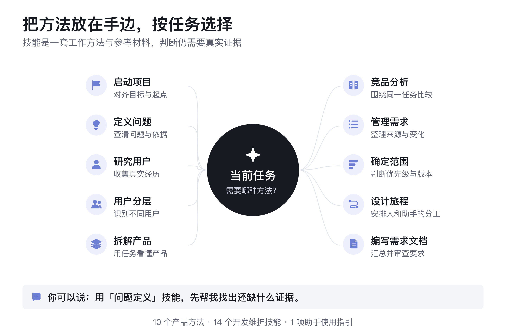
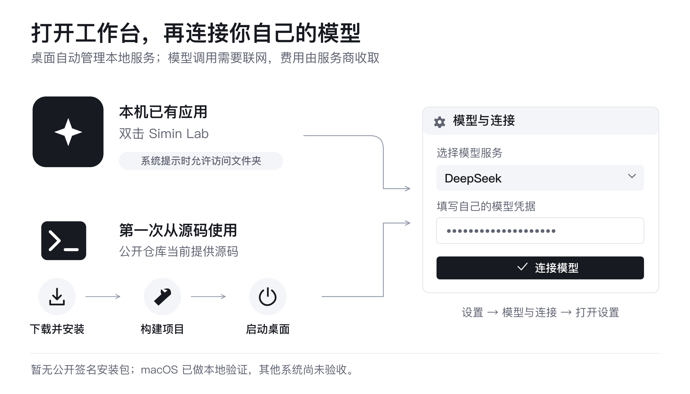
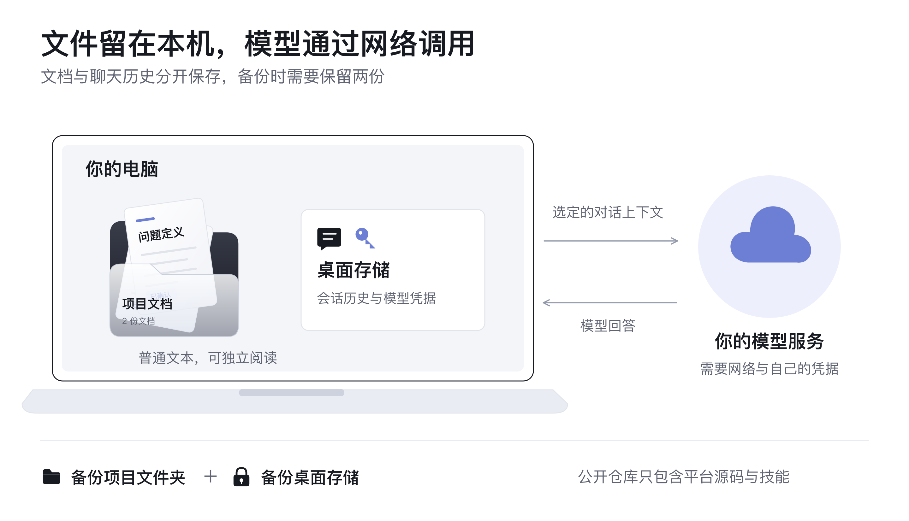
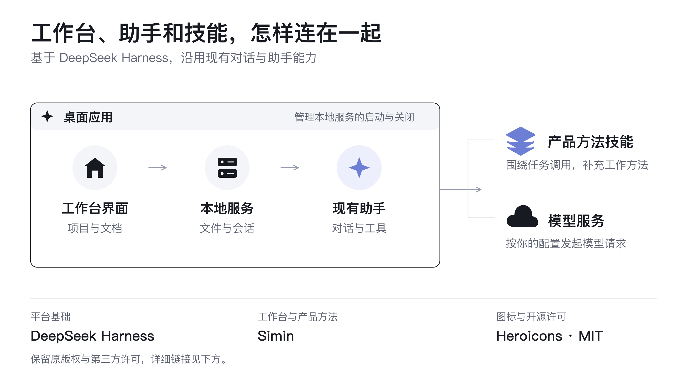

# Simin Lab · AI 产品经理工作台



[使用流程](#使用流程) · [界面地图](#界面地图) · [技能地图](#技能地图) · [启动地图](#启动地图) · [文件与服务](#文件与服务) · [问题速查](#问题速查) · [开发与来源](#开发与来源)

<a id="why-use-it"></a> <a id="what-you-can-do"></a> <a id="your-first-project"></a>

## 使用流程



## 界面地图



<a id="included-skills"></a>

## 技能地图



<details>
<summary>查看技能原文件与复用方法</summary>

[项目启动](.agents/skills/aipm-project-initiation/SKILL.md) · [问题定义](.agents/skills/aipm-problem-definition/SKILL.md) · [用户研究](.agents/skills/aipm-user-research/SKILL.md) · [用户分层](.agents/skills/aipm-user-segmentation/SKILL.md) · [产品拆解](.agents/skills/aipm-product-teardown/SKILL.md)

[竞品分析](.agents/skills/aipm-competitive-analysis/SKILL.md) · [需求管理](.agents/skills/aipm-requirements-management/SKILL.md) · [优先级与范围](.agents/skills/aipm-prioritization-scope/SKILL.md) · [用户旅程与协作](.agents/skills/aipm-journey-collaboration/SKILL.md) · [需求文档编写与评审](.agents/skills/aipm-prd-writing-review/SKILL.md)

[全部 25 个技能入口](.agents/skills)。在对话的技能选择器中选用；复制到其他兼容助手时，复制整个技能文件夹及其参考材料。

</details>

<a id="run"></a> <a id="run-from-source"></a> <a id="run-the-desktop-app"></a>

## 启动地图



<details>
<summary>第一次从源码使用：复制启动命令</summary>

准备 Node.js 24+、Corepack 和本机编译工具；苹果电脑需要 Xcode 命令行工具。[环境准备说明](docs/development.zh.md#前置条件)。仓库固定使用 pnpm 11.7.0。

```sh
git clone https://github.com/chusimin/Simin-Lab.git
cd Simin-Lab
corepack enable
corepack pnpm install --frozen-lockfile
corepack pnpm run build
DSH_DESKTOP_OPEN_DEVTOOLS=0 corepack pnpm run dev:desktop
```

首次构建成功后，再次启动：

```sh
DSH_DESKTOP_OPEN_DEVTOOLS=0 corepack pnpm run start:desktop
```

使用压缩包且没有版本历史时，构建前需要将 `DSH_CLIENT_COMMIT_HASH` 设为下载的源码版本标识；克隆仓库时自动获取。

桌面应用负责启动和关闭本地服务。使用时保留一个桌面实例，系统提示时允许访问所选文件夹；无需另开云服务器或同时运行 `dsh web`。

在「设置 → 模型与连接 → 打开设置」中配置自己的模型服务和凭据，默认服务为 DeepSeek。

</details>

<a id="files-and-data"></a>

## 文件与服务



<details>
<summary>查看保存位置</summary>

| 保存什么 | 默认位置 |
|---|---|
| 项目文档 | `projects/项目名/文档名.md` 或 `.txt` |
| 技能与参考材料 | `.agents/skills/` |
| 源码开发时的会话与配置 | `apps/desktop/.desktop-build/development/home/` |

启动前可用 `SIMIN_PROJECT_ROOT` 指定其他可写的项目根目录，建议使用绝对路径。打包应用的会话与配置位于所选桌面数据目录。

</details>

## 问题速查


<a id="development"></a> <a id="credits-and-license"></a>

## 开发与来源



[平台基础](https://github.com/deepseek-ai/deepseek-harness) · [图标来源](https://github.com/tailwindlabs/heroicons) · [开源许可](LICENSE) · [第三方许可](THIRD_PARTY_NOTICES.md) · [执行安全说明](SAFETY.zh.md) · [反馈问题](https://github.com/chusimin/Simin-Lab/issues)

<details>
<summary>开发入口</summary>

[工作约定](AGENTS.md) · [架构说明](docs/architecture.zh.md) · [开发指南](docs/development.zh.md)

[界面与交互](packages/client/ui-layout/src/client/SiminShell.tsx) · [工作区与会话恢复](packages/client/ui-workspace/src/client/index.ts) · [本机接口](packages/bundle/web-app/src/aipm-products.ts) · [文档管理](packages/bundle/web-app/src/simin-files.ts) · [写入审阅](packages/bundle/web-app/src/simin-proposals.ts) · [桌面外壳](apps/desktop)

[设计原型](prototypes/simin-v2/README.zh.md)使用示例数据；桌面应用读取真实文件。仓库保留上游构建与发布工作流，当前关闭 GitHub 自动任务。

</details>
