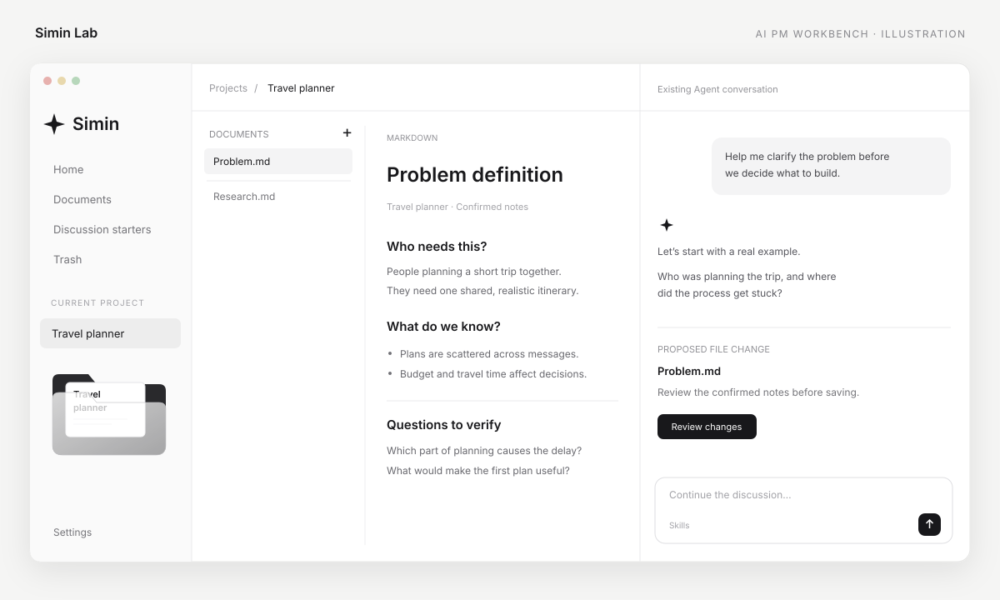
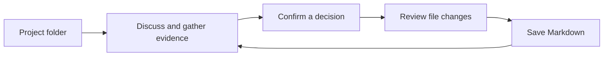
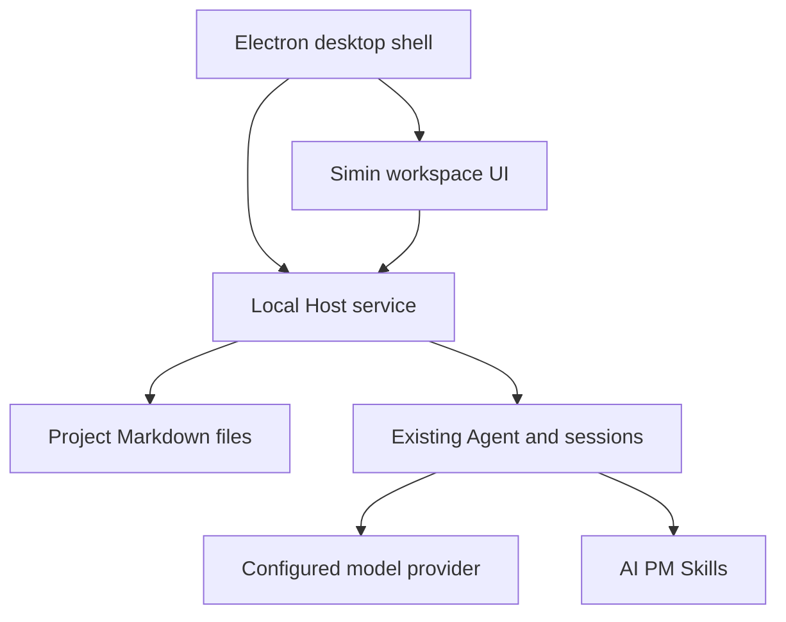

# Simin Lab · AI PM Workbench

English | [中文](README.zh.md)

**Turn a product idea into decisions you can explain and documents you can keep.**

Simin Lab is a local desktop workspace for AI product managers. Each project starts as a folder. Discuss the real problem with an Agent, supply evidence, review proposed changes, and save confirmed conclusions as independent Markdown files.

This community project builds on [DeepSeek Harness](https://github.com/deepseek-ai/deepseek-harness). It adds the Simin workspace and AI PM Skills while retaining the existing Agent and conversation engine.



*Illustration with fictional sample content; not a screenshot of personal project data.*

## Contents

- [Why use it](#why-use-it)
- [What you can do](#what-you-can-do)
- [Run the desktop app](#run-the-desktop-app)
- [Your first project](#your-first-project)
- [Included Skills](#included-skills)
- [Files and data](#files-and-data)
- [Development](#development)
- [Credits and license](#credits-and-license)

<a id="why-use-it"></a>
## Why use it

Product work often ends up scattered across chat histories, IDE tabs, and competing document versions. Simin keeps the discussion and its current documents together, so you can return to the reasoning and keep editing the actual files.

- **Evidence before conclusions.** The AI PM Skills ask for information that changes the decision and keep unknowns visible.
- **You keep the decisions.** Discuss alternatives, confirm important judgments, and review file changes before saving.
- **Documents remain usable.** Markdown files can be read, edited, backed up, and moved with ordinary tools.
- **A flexible project path.** Skills guide the work when needed; project stages are not hardcoded into the interface.



<a id="what-you-can-do"></a>
## What you can do

| Area | What it provides |
|---|---|
| Home | Create empty projects and open real folders; folder previews reflect their documents |
| Project | Browse documents, read Markdown, switch to source, edit, copy, and focus on reading |
| Conversation | Continue project discussions with the existing Agent and restore project conversations |
| Save review | Inspect proposed file changes, then confirm or cancel the write |
| Documents and search | Browse across projects and search project/document content; desktop conversation search uses the existing index |
| Discussion starters | Start with a small prompt template instead of an empty conclusion |
| Trash | Restore deleted documents or explicitly remove retained trash |
| Settings | Change workbench preferences and open the existing model/connection settings |

The desktop app is the intended entry point. This repository currently provides source; it does not publish a downloadable, signed Simin installer. macOS is the locally exercised platform. Windows and Linux are not validated for this customized desktop interface.

<a id="run"></a> <a id="run-from-source"></a> <a id="run-the-desktop-app"></a>
## Run the desktop app

Use Node.js **24+** and Corepack. The repository pins pnpm **11.7.0**. Building also needs the platform toolchain for the native addon; see the [development prerequisites](docs/development.md). On macOS, install Xcode Command Line Tools if they are missing.

```sh
git clone https://github.com/chusimin/Simin-Lab.git
cd Simin-Lab
corepack enable
corepack pnpm install --frozen-lockfile
corepack pnpm run build
DSH_DESKTOP_OPEN_DEVTOOLS=0 corepack pnpm run dev:desktop
```

`dev:desktop` prepares and launches the desktop shell. After the first successful build, use the following command for subsequent source-checkout launches:

```sh
DSH_DESKTOP_OPEN_DEVTOOLS=0 corepack pnpm run start:desktop
```

If you downloaded a ZIP without Git history, set `DSH_CLIENT_COMMIT_HASH` to the source revision before building; cloning the repository supplies it automatically.

### Connect a model

Open **Settings → Models and connections → Open settings**, then configure an available provider and your own credential. The shipped default uses DeepSeek. Model calls require a working provider connection and may incur provider charges; credentials are not included in this repository.

The desktop shell starts and stops its local Host service. You do not need a separate cloud server or an independently running `dsh web` process. Keep one desktop instance running while using it, and grant the OS access to the folder you chose when prompted.

### If startup fails

- Missing built artifacts: run `corepack pnpm run build`, then `corepack pnpm run dev:desktop` again.
- The app waits at startup on macOS: check for a system folder-access prompt.
- The window opens but a model request fails: check the model credential and connection in Settings.

<a id="your-first-project"></a>
## Your first project

1. Create a project on Home, for example `Travel planner`. Its folder begins empty.
2. Open the project and describe a real task: who faces the problem, what they do today, and what would count as a useful result.
3. Choose a relevant Skill in the conversation skill picker, or ask the Agent to use the named Skill. Supply missing information and compare alternatives.
4. When a conclusion is clear, ask: “Save the confirmed problem definition as a separate Markdown file in this project. Keep unresolved questions visible.”
5. Review the proposed file change and confirm it. The document appears in the project list and reading pane; later edits update those views.
6. Return to the same project to continue the discussion and refine its existing documents.

<a id="included-skills"></a>
## Included Skills

All **25 project-local Skill entries** are included under [`.agents/skills`](.agents/skills): 10 AI PM workflows, 14 Harness development/maintenance workflows, and the built-in Agent usage guide. A Skill is a readable set of working instructions with supporting references, not a separate model or a hardcoded project stage.

### AI PM methods

| Skill | Use it for |
|---|---|
| [aipm-project-initiation](.agents/skills/aipm-project-initiation/SKILL.md) | Project initiation |
| [aipm-problem-definition](.agents/skills/aipm-problem-definition/SKILL.md) | Problem definition |
| [aipm-user-research](.agents/skills/aipm-user-research/SKILL.md) | User research |
| [aipm-user-segmentation](.agents/skills/aipm-user-segmentation/SKILL.md) | User segmentation and profiles |
| [aipm-requirements-management](.agents/skills/aipm-requirements-management/SKILL.md) | Requirements management |
| [aipm-prioritization-scope](.agents/skills/aipm-prioritization-scope/SKILL.md) | Prioritization and version scope |
| [aipm-journey-collaboration](.agents/skills/aipm-journey-collaboration/SKILL.md) | User journeys and human–AI collaboration |
| [aipm-prd-writing-review](.agents/skills/aipm-prd-writing-review/SKILL.md) | PRD writing and review |
| [aipm-competitive-analysis](.agents/skills/aipm-competitive-analysis/SKILL.md) | Competitive analysis |
| [aipm-product-teardown](.agents/skills/aipm-product-teardown/SKILL.md) | Evidence-based product teardown |

For example: “Use `aipm-problem-definition`. Help me identify whose problem this is and what evidence is missing before drafting the document.” These Skills supply methods; research still depends on the evidence and tools available to the current Agent.

### Development and maintenance

These Skills are also published with their references:

- [dsh-archive-agent-notes](.agents/skills/dsh-archive-agent-notes/SKILL.md)
- [dsh-ci-test-reliability](.agents/skills/dsh-ci-test-reliability/SKILL.md)
- [dsh-client-ui-ux](.agents/skills/dsh-client-ui-ux/SKILL.md)
- [dsh-code-review](.agents/skills/dsh-code-review/SKILL.md)
- [dsh-create-upgrade-guide](.agents/skills/dsh-create-upgrade-guide/SKILL.md)
- [dsh-doc](.agents/skills/dsh-doc/SKILL.md)
- [dsh-find-simplifications](.agents/skills/dsh-find-simplifications/SKILL.md)
- [dsh-merging-stacked-prs](.agents/skills/dsh-merging-stacked-prs/SKILL.md)
- [dsh-pre-push-checks](.agents/skills/dsh-pre-push-checks/SKILL.md)
- [dsh-prose-standard](.agents/skills/dsh-prose-standard/SKILL.md)
- [dsh-speed-up-perf](.agents/skills/dsh-speed-up-perf/SKILL.md)
- [dsh-translate-docs](.agents/skills/dsh-translate-docs/SKILL.md)
- [dsh-trim-cot-leakage](.agents/skills/dsh-trim-cot-leakage/SKILL.md)
- [record-browser-gif](.agents/skills/record-browser-gif/SKILL.md)
- [agent-experience](.agents/skills/agent-experience/SKILL.md)

In a Git checkout, project sessions can discover the repository’s `.agents/skills` through the project root. To reuse an AI PM Skill in another compatible agent, copy its whole directory, including `references/`, into that agent’s project-local Skills directory.

<a id="files-and-data"></a>
## Files and data

The default project root is `projects/` beside this source checkout. You can set `SIMIN_PROJECT_ROOT` to another writable absolute directory before launching. Relative overrides resolve from the Host’s working directory; use an absolute path to avoid ambiguity.

```text
Simin-Lab/
├── .agents/skills/       # Included methods and references
├── projects/            # Your local projects; ignored by Git
│   ├── Travel planner/
│   │   ├── Problem.md
│   │   └── Research.md
│   └── .simin/          # Local save proposals and trash metadata
├── packages/            # Workbench and Agent runtime source
└── apps/desktop/        # Desktop shell
```

Project documents are local `.md` and `.txt` files. Conversation history and credentials use the existing Harness storage in the selected desktop home; they are separate from document files. Source development keeps that home under `apps/desktop/.desktop-build/development/home/` by default.

Back up project folders and your desktop home if you need both documents and conversation history. Publishing this repository does not upload your local projects: `projects/`, development storage, `.env` files, credentials, and packaged local builds are excluded by `.gitignore`. Model requests still send the selected conversation context to your configured model provider.

<a id="development"></a>
## Development

The workbench is built on the plugin architecture of DeepSeek Harness. Its project UI and local file routes wrap the existing conversation and Agent capabilities.



| Source | Responsibility |
|---|---|
| [packages/client/ui-layout/src/client/SiminShell.tsx](packages/client/ui-layout/src/client/SiminShell.tsx) | Workbench pages and interactions |
| [packages/client/ui-workspace/src/client/index.ts](packages/client/ui-workspace/src/client/index.ts) | Project workspace opening and session restoration |
| [packages/bundle/web-app/src/aipm-products.ts](packages/bundle/web-app/src/aipm-products.ts) | Local workbench HTTP routes |
| [packages/bundle/web-app/src/simin-files.ts](packages/bundle/web-app/src/simin-files.ts) | Documents, content versions, and trash |
| [packages/bundle/web-app/src/simin-proposals.ts](packages/bundle/web-app/src/simin-proposals.ts) | Review and confirmation of file changes |
| [apps/desktop](apps/desktop) | Desktop startup and lifecycle |

Read [AGENTS.md](AGENTS.md), the [architecture](docs/architecture.md), and the [development guide](docs/development.md) before changing packages. Report issues in [this repository](https://github.com/chusimin/Simin-Lab/issues). Upstream build, release, and CI workflows are retained from Harness; the initial public repository keeps GitHub Actions disabled rather than using DeepSeek’s release infrastructure.

The `prototypes/` directory contains design exploration with sample data. The desktop application reads real project files. Public source publication does not create a hosted multi-user service.

<a id="credits-and-license"></a>
## Credits and license

- Platform foundation: [DeepSeek Harness](https://github.com/deepseek-ai/deepseek-harness), by DeepSeek AI.
- Workbench design and AI PM methods: Simin.
- Interface icons: [Heroicons](https://github.com/tailwindlabs/heroicons), MIT; the source retains the icon license.

Released under [MIT](LICENSE). Original copyrights remain in place. See [third-party notices](THIRD_PARTY_NOTICES.md) and the upstream [safety notice](SAFETY.md) for dependencies and Agent execution behavior.
