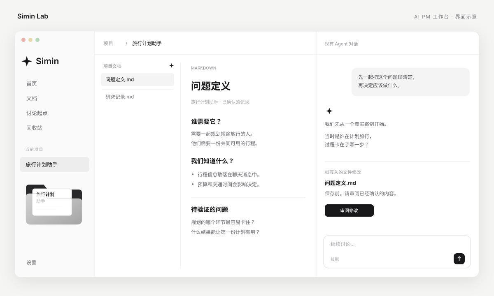
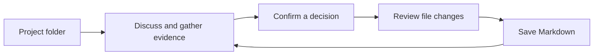
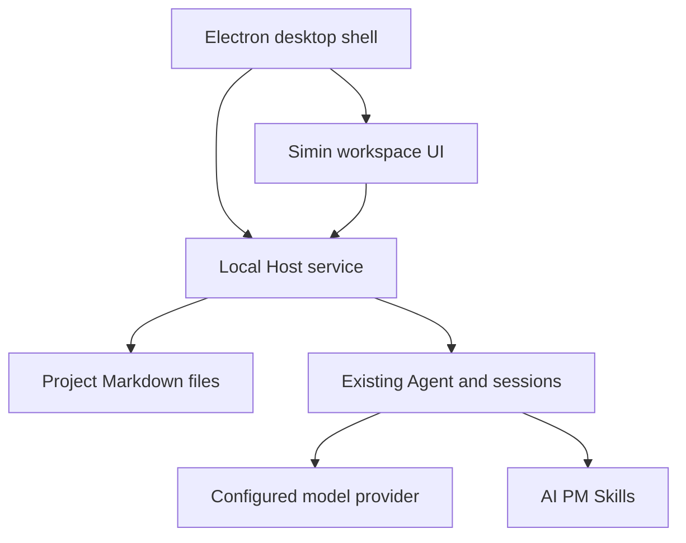

# Simin Lab · AI PM 工作台

[English](README.md) | 中文

**把产品想法聊清楚，把有依据的判断留下来。**

Simin Lab 是给 AI 产品经理使用的本地桌面工作台。每个项目从一个文件夹开始：和 Agent 讨论真实问题、补充证据、审阅修改，再把确认过的结论保存成独立的 Markdown 文件。

这是基于 [DeepSeek Harness](https://github.com/deepseek-ai/deepseek-harness) 构建的社区项目，增加了 Simin 工作界面和 AI PM Skills，沿用现有 Agent 与对话引擎。



*界面示意图使用虚构样例内容，不包含个人项目数据。*

## 目录

- [为什么用](#why-use-it)
- [能做什么](#what-you-can-do)
- [启动桌面端](#run-the-desktop-app)
- [完成第一个项目](#your-first-project)
- [内置 Skills](#included-skills)
- [文件与数据](#files-and-data)
- [开发与贡献](#development)
- [来源与许可](#credits-and-license)

<a id="why-use-it"></a>
## 为什么用

产品工作经常散落在聊天记录、IDE 标签页和不同版本的文档里。Simin 把讨论和当前文档放在同一个项目中，方便回到当时的判断，也方便继续修改实际文件。

- **先有依据，再下结论。** AI PM Skills 围绕会影响判断的信息补证据，保留尚未确定的问题。
- **关键判断由你确定。** 一起比较方案，确认重要决定，保存前看清文件修改。
- **文档可以独立使用。** Markdown 文件能用普通工具阅读、编辑、备份和迁移。
- **流程按项目需要展开。** 在需要时使用相应 Skill，界面不写死阶段名称。



<a id="what-you-can-do"></a>
## 能做什么

| 模块 | 你可以做什么 |
|---|---|
| 首页 | 新建空项目、打开实际文件夹；文件夹预览根据项目里的文档展示 |
| 项目 | 浏览文档、阅读 Markdown、切换源码、编辑、复制和专注阅读 |
| 对话 | 用现有 Agent 继续讨论，重新进入项目时恢复该项目的会话 |
| 保存审阅 | 查看拟写入的文件修改，再确认保存或取消 |
| 文档与搜索 | 跨项目浏览和搜索项目、文档内容；桌面对话搜索沿用现有索引 |
| 讨论起点 | 用简短提示模板开始讨论，不预填空结论 |
| 回收站 | 恢复删除的文档，或明确清除回收站内容 |
| 设置 | 调整工作台偏好，进入现有模型与连接设置 |

桌面应用是主要入口。当前仓库提供源码，尚未发布可下载、已签名的 Simin 安装包。定制桌面界面在 macOS 上进行了本地验证，Windows 和 Linux 尚未验收。

<a id="run"></a> <a id="run-from-source"></a> <a id="run-the-desktop-app"></a>
## 启动桌面端

使用 Node.js **24+** 和 Corepack。仓库固定 pnpm **11.7.0**；编译原生组件还需要对应平台的工具链，详见[开发环境要求](docs/development.zh.md)。macOS 如果没有安装 Xcode Command Line Tools，需要先安装。

```sh
git clone https://github.com/chusimin/Simin-Lab.git
cd Simin-Lab
corepack enable
corepack pnpm install --frozen-lockfile
corepack pnpm run build
DSH_DESKTOP_OPEN_DEVTOOLS=0 corepack pnpm run dev:desktop
```

`dev:desktop` 会准备并启动桌面外壳。第一次成功构建后，后续从源码启动可以使用：

```sh
DSH_DESKTOP_OPEN_DEVTOOLS=0 corepack pnpm run start:desktop
```

如果下载的是不含 Git 历史的 ZIP，构建前需要把 `DSH_CLIENT_COMMIT_HASH` 设为源码版本对应的提交哈希；使用 Git 克隆时会自动读取。

### 连接模型

打开**设置 → 模型与连接 → 打开设置**，配置可用的模型服务和你自己的凭据。默认组合使用 DeepSeek。模型调用需要能连接对应服务，费用由模型服务商收取；仓库不包含凭据。

桌面外壳会管理本地 Host 服务的启动与停止，不需要单独准备云服务器或常驻的 `dsh web` 进程。使用时保持一个桌面实例运行；系统提示访问所选目录时，按需要授权。

### 启动异常时

- 提示构建产物缺失：执行 `corepack pnpm run build`，再运行 `corepack pnpm run dev:desktop`。
- macOS 启动一直等待：检查是否有系统文件夹访问提示。
- 窗口正常打开，但模型请求失败：在设置中检查模型凭据和连接。

<a id="your-first-project"></a>
## 完成第一个项目

1. 在首页新建项目，例如「旅行计划助手」。生成的项目文件夹一开始是空的。
2. 进入项目，说明一个真实任务：谁遇到什么问题、现在怎样完成、什么结果才有用。
3. 在对话的技能选择器中选择适用 Skill，或明确让 Agent 使用该 Skill。补充关键信息，一起比较方案。
4. 结论清楚后，可以说：「把已经确认的问题定义保存成这个项目里的一份独立 Markdown；未解决的问题继续保留。」
5. 审阅拟写入的文件内容，确认后保存。文档会出现在项目列表和阅读区，后续修改也会刷新。
6. 之后回到同一项目，继续讨论和完善已有文档。

<a id="included-skills"></a>
## 内置 Skills

仓库完整包含 [`.agents/skills`](.agents/skills) 下的 **25 个项目 Skill 入口**：10 个 AI PM 方法 Skill、14 个 Harness 开发维护 Skill，以及底座内置的 Agent 使用指引。Skill 是可阅读的工作指引与参考材料，不是独立模型，也不是写死的项目阶段。

### AI PM 方法

| Skill | 适用工作 |
|---|---|
| [aipm-project-initiation](.agents/skills/aipm-project-initiation/SKILL.md) | 项目启动与目标梳理 |
| [aipm-problem-definition](.agents/skills/aipm-problem-definition/SKILL.md) | 问题定义 |
| [aipm-user-research](.agents/skills/aipm-user-research/SKILL.md) | 用户研究 |
| [aipm-user-segmentation](.agents/skills/aipm-user-segmentation/SKILL.md) | 用户分层与画像 |
| [aipm-requirements-management](.agents/skills/aipm-requirements-management/SKILL.md) | 需求整理与管理 |
| [aipm-prioritization-scope](.agents/skills/aipm-prioritization-scope/SKILL.md) | 优先级与版本范围 |
| [aipm-journey-collaboration](.agents/skills/aipm-journey-collaboration/SKILL.md) | 用户旅程与人机协作 |
| [aipm-prd-writing-review](.agents/skills/aipm-prd-writing-review/SKILL.md) | PRD 撰写与审查 |
| [aipm-competitive-analysis](.agents/skills/aipm-competitive-analysis/SKILL.md) | 竞品分析 |
| [aipm-product-teardown](.agents/skills/aipm-product-teardown/SKILL.md) | 基于证据的产品拆解 |

例如：「使用 `aipm-problem-definition`，先帮我确定这是谁的问题、还缺什么证据，再整理成文档。」这些 Skills 提供方法，调研仍依赖当前 Agent 可获得的证据和工具。

### 开发与维护

下列 Skills 及其参考资料也完整公开：

- [dsh-archive-agent-notes](.agents/skills/dsh-archive-agent-notes/SKILL.md)
- [dsh-ci-test-reliability](.agents/skills/dsh-ci-test-reliability/SKILL.md)
- [dsh-client-ui-ux](.agents/skills/dsh-client-ui-ux/SKILL.md)
- [dsh-code-review](.agents/skills/dsh-code-review/SKILL.md)
- [dsh-create-upgrade-guide](.agents/skills/dsh-create-upgrade-guide/SKILL.md)
- [dsh-doc](.agents/skills/dsh-doc/SKILL.md)
- [dsh-find-simplifications](.agents/skills/dsh-find-simplifications/SKILL.md)
- [dsh-merging-stacked-prs](.agents/skills/dsh-merging-stacked-prs/SKILL.md)
- [dsh-pre-push-checks](.agents/skills/dsh-pre-push-checks/SKILL.md)
- [dsh-prose-standard](.agents/skills/dsh-prose-standard/SKILL.md)
- [dsh-speed-up-perf](.agents/skills/dsh-speed-up-perf/SKILL.md)
- [dsh-translate-docs](.agents/skills/dsh-translate-docs/SKILL.md)
- [dsh-trim-cot-leakage](.agents/skills/dsh-trim-cot-leakage/SKILL.md)
- [record-browser-gif](.agents/skills/record-browser-gif/SKILL.md)
- [agent-experience](.agents/skills/agent-experience/SKILL.md)

在 Git 克隆的仓库中，项目会话可以通过项目根目录发现 `.agents/skills`。在其他兼容 Agent 中复用 AI PM Skill 时，请复制完整的 Skill 目录，包括其中的 `references/`，放入对应 Agent 的项目技能目录。

<a id="files-and-data"></a>
## 文件与数据

默认项目目录是当前源码仓库下的 `projects/`。也可以在启动前用 `SIMIN_PROJECT_ROOT` 指定其他可写的绝对目录。相对路径会从 Host 工作目录解析，建议使用绝对路径。

```text
Simin-Lab/
├── .agents/skills/       # Included methods and references
├── projects/            # Your local projects; ignored by Git
│   ├── Travel planner/
│   │   ├── Problem.md
│   │   └── Research.md
│   └── .simin/          # Local save proposals and trash metadata
├── packages/            # Workbench and Agent runtime source
└── apps/desktop/        # Desktop shell
```

项目文档是本地 `.md` 和 `.txt` 文件。会话历史和凭据使用所选桌面 home 下已有的 Harness 存储，与文档文件分开保存。源码开发默认 home 位于 `apps/desktop/.desktop-build/development/home/`。

需要同时保留文档和聊天历史时，请备份项目目录与桌面 home。公开源码不会上传本地项目：`projects/`、开发存储、`.env` 文件、凭据和本地应用构建产物均由 `.gitignore` 排除。模型请求仍会把选定的对话上下文发送给你配置的模型服务。

<a id="development"></a>
## 开发与贡献

工作台基于 DeepSeek Harness 的插件架构，项目界面与本地文件接口承接现有对话和 Agent 能力。



| 源码 | 职责 |
|---|---|
| [packages/client/ui-layout/src/client/SiminShell.tsx](packages/client/ui-layout/src/client/SiminShell.tsx) | 工作台页面与交互 |
| [packages/client/ui-workspace/src/client/index.ts](packages/client/ui-workspace/src/client/index.ts) | 项目工作区打开与会话恢复 |
| [packages/bundle/web-app/src/aipm-products.ts](packages/bundle/web-app/src/aipm-products.ts) | 本地工作台 HTTP 接口 |
| [packages/bundle/web-app/src/simin-files.ts](packages/bundle/web-app/src/simin-files.ts) | 文档、内容版本与回收站 |
| [packages/bundle/web-app/src/simin-proposals.ts](packages/bundle/web-app/src/simin-proposals.ts) | 文件修改审阅与确认 |
| [apps/desktop](apps/desktop) | 桌面启动与生命周期 |

修改包前请读 [AGENTS.md](AGENTS.md)、[架构说明](docs/architecture.zh.md)和[开发指南](docs/development.zh.md)。问题反馈请提交到[本仓库](https://github.com/chusimin/Simin-Lab/issues)。仓库保留 Harness 的构建、发布与 CI 工作流；首次公开时关闭 GitHub Actions，不使用 DeepSeek 的发布基础设施。

`prototypes/` 中是带示例数据的设计探索；桌面应用读取实际项目文件。公开源码不等于提供托管的多人在线服务。

<a id="credits-and-license"></a>
## 来源与许可

- 平台基础：[DeepSeek Harness](https://github.com/deepseek-ai/deepseek-harness)，由 DeepSeek AI 开发。
- 工作台设计与 AI PM 方法：Simin。
- 界面图标：[Heroicons](https://github.com/tailwindlabs/heroicons)，MIT 许可；源码保留图标许可。

采用 [MIT 许可](LICENSE)，保留原版权声明。依赖与 Agent 执行行为详见[第三方许可声明](THIRD_PARTY_NOTICES.md)和上游[安全说明](SAFETY.zh.md)。
